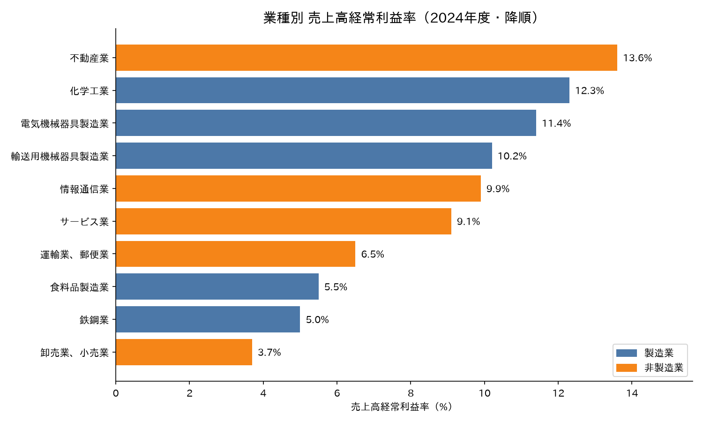
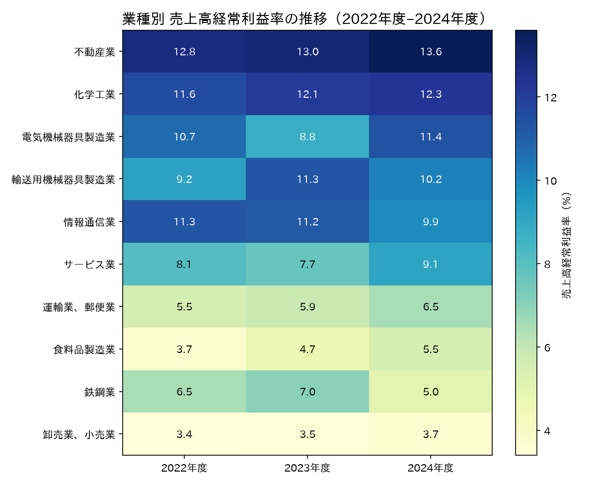

# 日本の業種別「売上高経常利益率」比較（2022–2024年度）

財務省「法人企業統計調査」の実データをもとに、主要10業種（製造業5・非製造業5）の
**売上高経常利益率**を比較・可視化したプロジェクトです。

## グラフ

### 最新年度（2024年度）ランキング



### 直近3年度の推移ヒートマップ



## データ

| 業種 | 区分 | 2022年度 | 2023年度 | 2024年度 |
|---|---|---:|---:|---:|
| 不動産業 | 非製造業 | 12.8 | 13.0 | 13.6 |
| 化学工業 | 製造業 | 11.6 | 12.1 | 12.3 |
| 電気機械器具製造業 | 製造業 | 10.7 | 8.8 | 11.4 |
| 輸送用機械器具製造業 | 製造業 | 9.2 | 11.3 | 10.2 |
| 情報通信業 | 非製造業 | 11.3 | 11.2 | 9.9 |
| サービス業 | 非製造業 | 8.1 | 7.7 | 9.1 |
| 運輸業、郵便業 | 非製造業 | 5.5 | 5.9 | 6.5 |
| 食料品製造業 | 製造業 | 3.7 | 4.7 | 5.5 |
| 鉄鋼業 | 製造業 | 6.5 | 7.0 | 5.0 |
| 卸売業、小売業 | 非製造業 | 3.4 | 3.5 | 3.7 |

（単位: %。ソートは2024年度降順）

- **指標の定義**: 売上高経常利益率 = 経常利益 ÷ 売上高 × 100
- **出典**: 財務省・財務総合政策研究所「法人企業統計調査」年次別調査（確定決算ベース）
  第4表「売上高利益率の推移」（金融業・保険業を除く、全規模合計）
  - [令和4年度（2023年9月公表）](https://www.mof.go.jp/pri/reference/ssc/results/r4.pdf)
  - [令和5年度（2024年9月公表）](https://www.mof.go.jp/pri/reference/ssc/results/r5.pdf)
  - [令和6年度（2025年9月公表）](https://www.mof.go.jp/pri/reference/ssc/results/r6.pdf)
- **注**: 年次別調査の公表表では卸売業・小売業は集約区分のため、本データも集約値です。

## 分析：なぜ業種によって利益率がこれほど違うのか

### 上位：不動産業・化学・電気機械・輸送用機械・情報通信業

- **不動産業（13.6%）**: 賃貸ビジネスは一度物件を取得すれば継続的な家賃収入が見込め、
  在庫リスクが小さく粗利構造が高い。近年はオフィス・住宅市況の回復や販売用不動産の
  売却益も押し上げ要因。
- **化学工業（12.3%）**: 機能性化学品や電子材料など高付加価値品の比重が高く、
  原料高も価格転嫁で吸収しやすい。差別化された製品ほどプライシングパワーが働く。
- **電気機械器具製造業（11.4%）**: 工場自動化・半導体関連需要の拡大に加え、
  円安による輸出採算の改善が寄与。2023年度の落ち込みは半導体サイクルの調整局面を反映。
- **輸送用機械器具製造業（自動車中心、10.2%）**: 円安と車両価格の引き上げ（価格転嫁）で
  高水準を維持。ただし販売台数や為替に左右されやすい。
- **情報通信業（9.9%）**: ソフトウェア・プラットフォーム型ビジネスは限界費用が低く、
  売上が伸びるほど利益率が上がる構造。2024年度の低下は人件費・投資負担の増加が背景。

### 中位：サービス業・運輸業

- **サービス業（9.1%）**: 人材サービスや広告など景気回復の恩恵を受け改善傾向。
  労働集約型だが、業態によっては高粗利。
- **運輸業、郵便業（6.5%）**: 燃料費・人件費の上昇に見合う運賃改定（価格転嫁）が
  進み、2021年度から3年連続で改善。2024年問題を背景とした適正運賃の浸透が寄与。

### 下位：食料品・鉄鋼・卸売業、小売業

- **食料品製造業（5.5%）**: 原材料高を値上げで転嫁し改善しているが、
  競争が激しく消費者の価格敏感度高く、利益率は低めに抑えられる。
- **鉄鋼業（5.0%）**: 鉄鉱石・石炭など原料市況とエネルギーコストに大きく左右され、
  高炉の維持など重い設備負担がある一次素材産業。2024年度は中国発の供給過剰と
  国内需要低迷で悪化。
- **卸売業、小売業（3.7%）**: 典型的な「薄利多売」モデル。商流の中間に位置して
  付加価値の付けられる余地が小さく、売上に対する粗利が構造的に薄い。

### 構造的なまとめ

利益率の高低は主に3つの要因で説明できます。

1. **粗利の厚さ（付加価値率）**: 無形資産・差別化製品・専有資産（不動産）を持つ業種ほど高い
2. **プライシングパワー**: 市況や原価上昇を価格に転嫁できるか
3. **資産・コスト構造**: 設備投資・在庫・エネルギー負担が重い業種ほど利益が削られる

## 再現方法

```bash
python -m venv .venv
source .venv/bin/activate
pip install -r requirements.txt
python plot_profit_margins.py
```

`images/` に2枚のPNGが生成されます。日本語表示には
[japanize-matplotlib](https://github.com/uehara1414/japanize-matplotlib) を使用しています。
